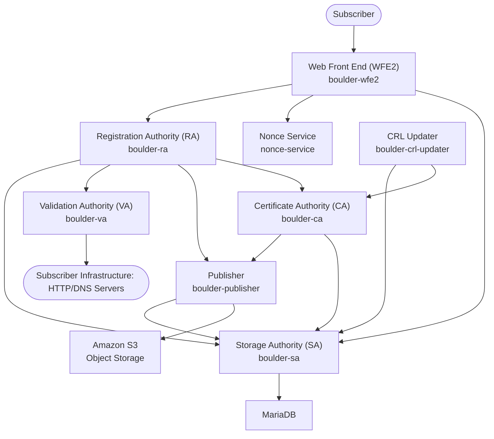

# AI Agent Development Guide for Boulder

## Goals and Context

This document serves as a comprehensive reference for AI agents assisting with feature development, debugging, and maintenance tasks within the Boulder ACME Certificate Authority project. Boulder is a production-grade implementation of the ACME protocol (RFC 8555) used by Let's Encrypt to issue millions of certificates.

### Purpose

- **Enable AI-assisted development**: Provide structured information that AI agents can reliably interpret to understand Boulder's architecture, services, and development patterns
- **Accelerate feature implementation**: Guide AI agents through Boulder's microservices architecture to implement new features correctly
- **Improve debugging efficiency**: Help AI agents quickly identify the right services and code paths when troubleshooting issues
- **Maintain code quality**: Ensure AI-generated code follows Boulder's established patterns and security practices

### Boulder's Architecture Philosophy

Boulder implements a security-oriented microservices architecture where:

- **Security contexts are separated**: Internet-facing services (WFE2, VA, Publisher) are isolated from internal services (RA, CA, SA)
- **Services communicate via gRPC**: All inter-service communication uses protocol buffers and gRPC for type safety and performance
- **Storage is centralized**: The Storage Authority (SA) acts as the single source of truth for all persistent data
- **Validation is distributed**: Multiple Validation Authority instances provide network perspective diversity for domain validation

### AI Agent Assistance Areas

AI agents can effectively assist with:

- **ACME endpoint implementation**: Adding new ACME protocol features to WFE2
- **Validation logic**: Implementing new challenge types or validation methods in VA
- **Certificate policies**: Adding policy enforcement in RA and CA services
- **Database operations**: Extending SA with new data models or queries
- **Monitoring and observability**: Adding metrics, logging, and health checks
- **Testing and integration**: Creating unit tests, integration tests, and test fixtures

### Key Constraints for AI Development

- **No standalone services**: New features should extend existing services rather than creating new microservices
- **gRPC interfaces**: All service-to-service communication must use defined protocol buffer interfaces
- **Database migrations**: Schema changes require proper migration scripts in `sa/db/`
- **Feature flags**: New functionality should be gated behind feature flags for gradual rollout
- **Security first**: All changes must consider security implications and follow Boulder's threat model
- **No AI-specific comments**: Do not add comments to code or diagrams explaining AI actions or modifications; commit messages and PR descriptions are the appropriate place for such explanations

# Boulder Services

Boulder implements a microservices architecture for the ACME Certificate Authority, with distinct services handling different aspects of certificate issuance and management. This document outlines the core services, their responsibilities, and how they interact.

## Architecture Overview

Boulder follows a security-oriented design where components are separated by security context and network requirements:



## Core Services

### 1. **Web Front End (WFE2)** - `boulder-wfe2`

**Path:** `cmd/boulder-wfe2/`  
**Package:** `wfe2/`

The ACME protocol HTTP API endpoint that handles all client interactions.

**Responsibilities:**

- Implements ACME v2 RFC 8555 protocol endpoints
- JWS signature verification and authentication
- Rate limiting and abuse prevention
- CORS handling and HTTP request processing
- Account management endpoints
- Order and authorization management
- Challenge coordination

**Key Endpoints:**

- `/directory` - ACME directory with endpoint URLs
- `/acme/new-acct` - Account registration
- `/acme/new-order` - Certificate order creation
- `/acme/authz/{id}` - Authorization management
- `/acme/chall/{id}` - Challenge handling
- `/acme/finalize/{id}` - Order finalization
- `/acme/cert/{id}` - Certificate retrieval

**Dependencies:** RA, SA, Nonce Service

**AI Development Notes:**

- **Common tasks**: Adding new ACME endpoints, implementing protocol extensions, enhancing error handling
- **Key files**: `wfe2/wfe.go` (main handler logic), `wfe2/verify.go` (JWS verification)
- **Testing patterns**: Use `test/integration/` tests for full ACME flow validation
- **Rate limiting**: Configured via `wfe2-ratelimit-defaults.yml` and `wfe2-ratelimit-overrides.yml`

### 2. **Registration Authority (RA)** - `boulder-ra`

**Path:** `cmd/boulder-ra/`  
**Package:** `ra/`

Central orchestrator for certificate issuance workflow and policy enforcement.

**Responsibilities:**

- Account registration and management
- Certificate order processing and lifecycle management
- Authorization creation and validation coordination
- Policy enforcement (CAA, domain validation, rate limits)
- Certificate finalization and issuance coordination
- ACME object lifecycle management

**Key Operations:**

- `NewRegistration()` - Account creation
- `NewOrder()` - Certificate order creation with authorizations
- `PerformValidation()` - Challenge validation initiation
- `FinalizeOrder()` - Certificate issuance request processing

**Dependencies:** VA, CA, SA, Publisher

**AI Development Notes:**

- **Common tasks**: Implementing new certificate policies, adding validation rules, order workflow modifications
- **Key files**: `ra/ra.go` (main service logic), `ra/proto/ra.proto` (gRPC interface definitions)
- **Policy areas**: Rate limiting, CAA checking, domain validation policies, certificate profiles
- **Testing patterns**: Mock VA/CA/SA interactions for unit tests, use `ra/ra_test.go` patterns
- **Error handling**: Use `probs/probs.go` for ACME-compliant error responses

### 3. **Validation Authority (VA)** - `boulder-va`

**Path:** `cmd/boulder-va/`  
**Package:** `va/`

Performs domain control validation using ACME challenge types.

**Responsibilities:**

- HTTP-01 challenge validation (web server verification)
- DNS-01 challenge validation (DNS record verification)
- TLS-ALPN-01 challenge validation (TLS certificate verification)
- CAA record checking and policy enforcement
- Multi-perspective validation coordination
- Network reachability and security checks

**Challenge Types:**

- **HTTP-01:** Validates control via HTTP well-known URI
- **DNS-01:** Validates control via DNS TXT record
- **TLS-ALPN-01:** Validates control via TLS certificate

**Dependencies:** Remote VAs, DNS resolvers

**AI Development Notes:**

- **Common tasks**: Implementing new challenge types, enhancing validation security, adding CAA policy checks
- **Key files**: `va/va.go` (main validation logic), `va/http.go`, `va/dns.go`, `va/tlsalpn.go` (challenge-specific code)
- **Validation patterns**: Each challenge type has validate/cleanup phases, use existing patterns
- **Security considerations**: DNS hijacking protection, network isolation, timeout handling
- **Testing**: Use `va/va_test.go` patterns, mock DNS/HTTP responses with `bdns/` and `test/chall-test-srv/`
- **Multi-perspective**: Remote VA coordination via `cmd/remoteva/`

### 4. **Certificate Authority (CA)** - `boulder-ca`

**Path:** `cmd/boulder-ca/`  
**Package:** `ca/`

Core certificate issuance engine with cryptographic operations.

**Responsibilities:**

- X.509 certificate generation and signing
- Certificate serial number management
- Precertificate generation for Certificate Transparency
- Certificate profile enforcement
- Cryptographic policy enforcement
- Certificate lifecycle management

**Security Features:**

- HSM integration via PKCS#11
- Certificate Transparency integration
- Multiple issuer certificate support
- Certificate profile validation

**Dependencies:** SA, CT logs (via Publisher)

**AI Development Notes:**

- **Common tasks**: Adding certificate extensions, implementing new certificate profiles, enhancing issuance policies
- **Key files**: `ca/ca.go` (main issuance logic), `issuance/cert.go` (certificate generation), `ca/proto/ca.proto` (gRPC interface)
- **Certificate profiles**: Defined in `issuance/` package, use existing profile patterns
- **HSM operations**: All private key operations go through PKCS#11 interface
- **Testing**: Use test certificates in `test/certs/`, mock HSM with `test/` helpers
- **Security note**: The CA service is designed to be heavily network-restricted in production environments, with all private key operations handled by an HSM. It should have minimal inbound and outbound network access.

### 5. **Storage Authority (SA)** - `boulder-sa`

**Path:** `cmd/boulder-sa/`  
**Package:** `sa/`

Database abstraction layer and persistent storage management.

**Responsibilities:**

- Database operations and transaction management
- ACME object persistence (accounts, orders, authorizations, certificates)
- Certificate storage and retrieval
- Rate limiting data management
- Database schema management and migrations
- Audit logging and compliance

**Data Models:**

- Registrations (ACME accounts)
- Orders and authorizations
- Challenges and validations
- Certificates and issuance records
- Rate limit counters

**Dependencies:** MariaDB/MySQL database

**AI Development Notes:**

- **Common tasks**: Adding new database tables, implementing data queries, creating migrations
- **Key files**: `sa/sa.go` (main service), `sa/model.go` (data models), `sa/proto/sa.proto` (gRPC interface)
- **Database patterns**: Use GORM for ORM, follow existing model patterns in `sa/model.go`
- **Migrations**: Add to `sa/db/boulder_sa/` with timestamp prefix, test with `sa/migrations.sh`
- **Testing**: Use `test/create_db.sh` for test database setup, `satest/satest.go` for helpers
- **Performance**: Consider read replicas, use `sa_ro` user for read-only operations

### 6. **Publisher** - `boulder-publisher`

**Path:** `cmd/boulder-publisher/`  
**Package:** `publisher/`

Handles Certificate Transparency log submission and external integrations.

**Responsibilities:**

- Certificate Transparency log submission
- SCT (Signed Certificate Timestamp) collection
- External compliance reporting
- Certificate publication workflows
- Publishing artifacts (e.g., CRLs) to external object storage (e.g., Amazon S3)

**Dependencies:** CT logs, SA, External Object Storage (e.g., Amazon S3)

**AI Development Notes:**

- **Common tasks**: Adding new CT log endpoints, implementing submission policies, enhancing retry logic, integrating with new external storage.
- **Key files**: `publisher/publisher.go` (main submission logic), `ctpolicy/ctpolicy.go` (CT policy enforcement)
- **CT integration**: Follows RFC 6962, submits precertificates and collects SCTs
- **Testing**: Use `test/ct-test-srv/` for CT log mocking, `ctpolicy/ctpolicy_test.go` patterns

### 7. **Nonce Service** - `nonce-service`

**Path:** `cmd/nonce-service/`  
**Package:** `nonce/`

Provides cryptographic nonces for ACME request replay protection. It generates nonces by encrypting a monotonically increasing counter. Redemption involves decrypting and validating the counter against a window of acceptable values and a list of already used nonces.

**Responsibilities:**

- Nonce generation: Creates unique nonces, typically by encrypting an internal counter.
- Nonce validation: Checks if a provided nonce is legitimate, unused, and within its validity period.
- Anti-replay attack protection: Ensures each nonce is used only once.
- HMAC-based nonce prefixing: Derives a nonce prefix using HMAC-SHA256 from the service's listening address and a configured secret key (`NonceHMACKey`). This helps ensure nonces are instance-specific or group-specific if keys are shared.
- Manages nonce lifecycle using internal counters (`latest`, `earliest`) and a cross-off list for redeemed nonces.

**gRPC Interface (`nonce.proto`):**

- `Nonce(google.protobuf.Empty) returns (NonceMessage)`: Retrieves a new nonce.
- `Redeem(NonceMessage) returns (ValidMessage)`: Validates a submitted nonce.

**Dependencies:**

- A configured `NonceHMACKey` (secret key file). This key is used with the service's gRPC address to derive a unique prefix for nonces generated by a specific instance, aiding in nonce management in multi-instance deployments.
- The Nonce Service, as implemented in `nonce/nonce.go` and configured in the typical development/test setups (e.g., `test/config/nonce-a.json`), uses an in-memory store for tracking recently issued and redeemed nonces.

**AI Development Notes:**

- **Common tasks**: Enhancing nonce validation algorithms, implementing distributed nonce tracking, performance optimization
- **Key files**: `nonce/nonce.go` (main nonce logic), `nonce/proto/nonce.proto` (gRPC interface)
- **Security considerations**: Nonce uniqueness, replay protection, cryptographic strength
- **Testing**: Use `nonce/nonce_test.go` patterns, test nonce generation and validation flows

## Supporting Services

### 8. **Remote Validation Authority (Remote VA)** - `remoteva`

**Path:** `cmd/remoteva/`

Provides multi-perspective validation from different network vantage points.

**Responsibilities:**

- Remote validation execution
- Geographic diversity in validation
- Network path diversity
- Validation result aggregation

### 9. **Simplified Front End (SFE)** - `sfe`

**Path:** `cmd/sfe/`  
**Package:** `sfe/`

Self-service portal for account management and certificate services.

**Responsibilities:**

- Account unpausing interface
- Subscriber self-service operations
- Web-based certificate management
- User-facing documentation and help

### 10. **Observer** - `boulder-observer`

**Path:** `cmd/boulder-observer/`  
**Package:** `observer/`

Monitoring and metrics collection service.

**Responsibilities:**

- Certificate transparency log monitoring
- Certificate issuance monitoring
- Compliance and audit reporting
- Anomaly detection

### 11. **CRL Updater** - `boulder-crl-updater`

**Path:** `cmd/boulder-crl-updater/` (presumed, verify actual path)  
**Packages:** `crl/updater/`, `crl/checker/`, `crl/storer/`

Manages the lifecycle of Certificate Revocation Lists (CRLs). This service or tool is responsible for generating new CRLs, ensuring their correctness, having them signed by the CA, and making them available for distribution.

**Responsibilities:**

- **CRL Generation**: Compiles lists of revoked certificates from data in the Storage Authority (SA).
- **CRL Signing**: Coordinates with the Certificate Authority (CA) to sign newly generated CRLs.
- **CRL Storage**: Stores signed CRLs, typically using the Storage Authority (SA), so they can be published.
- **CRL Checking**: Performs validation checks on CRLs, utilizing functionality from the `crl/checker/` package.
- **Scheduling**: Often runs as a periodic job to ensure CRLs are kept up-to-date.

**Key Operations & Packages:**

- Uses the `crl/updater/` package for overall orchestration.
- Leverages `crl/checker/` for validating CRL contents and structure.
- Interacts with `crl/storer/` (or directly with SA) for persisting and retrieving CRL data.
- Common CRL definitions and types are in `crl/crl.go`.

**Dependencies:** CA, SA

**AI Development Notes:**

- **Common tasks**: Modifying CRL generation logic, updating CRL profiles or extensions, enhancing CRL validation, changing storage mechanisms.
- **Key files**: `crl/updater/updater.go` (likely main logic), `crl/checker/checker.go`, `crl/storer/storer.go`.
- **Interaction points**: Understand how it fetches revocation data (from SA), requests signing (from CA), and stores CRLs (to SA).

## Service Communication

All inter-service communication uses **gRPC** with protocol buffer definitions located in:

- `ca/proto/` - Certificate Authority interfaces
- `ra/proto/` - Registration Authority interfaces
- `sa/proto/` - Storage Authority interfaces
- `va/proto/` - Validation Authority interfaces

### Security Context Separation

**Internet-facing services** (higher risk):

- WFE2 - Public ACME API
- VA - Domain validation
- Publisher - External log submission

**Internal services** (lower risk):

- RA - Internal coordination
- CA - Certificate signing (air-gapped)
- SA - Database operations

### Service Discovery

Boulder uses **Consul** for service discovery and health checking, with configuration in `test/consul/config.hcl`.

## Administrative Tools

Boulder includes various administrative and operational tools in `cmd/`:

- **admin** - Administrative operations
- **cert-checker** - Certificate validation and analysis
- **expiration-mailer** - Certificate expiration notifications
- **log-validator** - Certificate Transparency log validation
- **contact-auditor** - Account contact validation
- **bad-key-revoker** - Compromised key handling

## Development and Testing

**Test Infrastructure:**

- `test/` - Integration and end-to-end tests
- Docker Compose setup for local development
- Extensive unit and integration test coverage
- Load testing and performance validation tools

**Configuration:**

- YAML-based configuration management
- Feature flags for gradual rollouts
- Environment-specific settings
- Rate limiting configuration

This microservices architecture provides security through isolation, scalability through independent scaling, and maintainability through clear component boundaries. Each service has a well-defined responsibility and communicates through stable gRPC interfaces.

## Examples and Templates

This section provides concrete, real-world examples derived from Boulder's actual codebase and recent development history. These templates follow established patterns used throughout the project.

### Recent Development Patterns

Based on recent commits (e.g., PR #8221 "ratelimits: Add IP address identifier support"), here are common development patterns:

#### 1. Adding New Rate Limit Support

**Pattern**: Extending rate limits to handle new identifier types (like IP addresses)

```go
// From ratelimits/transaction.go - New rate limit transaction builder
func (builder *TransactionBuilder) newIdentifierTransaction(identifier core.Identifier) (Transaction, error) {
    bucketKey := newIdentifierBucketKey(SomeRateLimit, identifier)
    limit, err := builder.getLimit(SomeRateLimit, bucketKey)
    if err != nil {
        if errors.Is(err, errLimitDisabled) {
            return newAllowOnlyTransaction(), nil
        }
        return Transaction{}, err
    }
    return newTransaction(limit, bucketKey, 1)
}

// Helper function for bucket key generation
func newIdentifierBucketKey(name Name, identifier core.Identifier) string {
    return joinWithColon(name.EnumString(), identifier.Value)
}
```

**Testing Pattern** (from `TestNewRegistrationsPerIPAddressTransactions`):

```go
func TestNewIdentifierTransactions(t *testing.T) {
    t.Parallel()

    tb, err := NewTransactionBuilderFromFiles("../test/config-next/wfe2-ratelimit-defaults.yml", "")
    test.AssertNotError(t, err, "creating TransactionBuilder")

    // Test the transaction creation
    txn, err := tb.newIdentifierTransaction(someIdentifier)
    test.AssertNotError(t, err, "creating transaction")
    test.AssertEquals(t, txn.bucketKey, "expected:bucket:key")
    test.Assert(t, txn.check && txn.spend, "should be check-and-spend")
}
```

#### 2. Service Constructor Pattern

**Pattern**: All Boulder services follow consistent constructor patterns

```go
// From ra/ra.go - Service constructor with full dependency injection
func NewRegistrationAuthorityImpl(
    clk clock.Clock,
    logger blog.Logger,
    stats prometheus.Registerer,
    maxContactsPerReg int,
    keyPolicy goodkey.KeyPolicy,
    // ... other dependencies
) (*RegistrationAuthorityImpl, error) {
    // Validation
    if maxContactsPerReg <= 0 {
        return nil, fmt.Errorf("maxContactsPerReg must be > 0")
    }

    // Initialize metrics
    someMetric := prometheus.NewHistogramVec(
        prometheus.HistogramOpts{
            Name: "service_operation_duration",
            Help: "Duration of service operations",
        },
        []string{"operation", "result"},
    )
    stats.MustRegister(someMetric)

    return &RegistrationAuthorityImpl{
        clk:            clk,
        log:            logger,
        stats:          stats,
        maxContacts:    maxContactsPerReg,
        keyPolicy:      keyPolicy,
        someMetric:     someMetric,
    }, nil
}
```

#### 3. Error Handling Patterns

**Pattern**: Boulder uses consistent error wrapping and Boulder-specific errors

```go
// Standard error wrapping pattern
func (ra *RegistrationAuthorityImpl) someOperation(ctx context.Context, req *SomeRequest) (*SomeResponse, error) {
    result, err := ra.dependency.DoSomething(ctx, req.Data)
    if err != nil {
        // Wrap with context - very common pattern in Boulder
        return nil, fmt.Errorf("doing something for request %d: %w", req.ID, err)
    }

    // Validation with Boulder errors
    if result.IsInvalid() {
        return nil, berrors.BadRequestError("invalid result: %s", result.Reason)
    }

    return &SomeResponse{Data: result}, nil
}

// Helper function pattern for error creation
func makeTxnError(err error, limit Name) error {
    return fmt.Errorf("error constructing rate limit transaction for %s rate limit: %w", limit, err)
}
```

#### 4. Database Transaction Patterns

**Pattern**: Boulder uses consistent transaction handling with rate limiting

```go
// From ra/ra.go - Rate limit checking before database operations
func (ra *RegistrationAuthorityImpl) checkAndSpendLimits(ctx context.Context, regId int64, identifiers []identifier.ACMEIdentifier) (func(), error) {
    // Build transactions
    txns, err := ra.txnBuilder.SomeOperationTransactions(regId, identifiers)
    if err != nil {
        return nil, fmt.Errorf("building limit transactions: %w", err)
    }

    // Check and spend atomically
    decision, err := ra.limiter.BatchSpend(ctx, txns)
    if err != nil {
        return nil, fmt.Errorf("spending limits: %w", err)
    }

    // Create rollback function
    rollback := func() {
        // Rollback logic here
    }

    // Check decision result
    if err := decision.Result(ra.clk.Now()); err != nil {
        return rollback, err
    }

    return rollback, nil
}
```

#### 5. gRPC Service Implementation Pattern

**Pattern**: All Boulder gRPC services follow this structure

```go
// From ra/ra.go - gRPC method implementation
func (ra *RegistrationAuthorityImpl) SomeGRPCMethod(ctx context.Context, req *pb.SomeRequest) (*pb.SomeResponse, error) {
    // Input validation
    if req.SomeField == "" {
        return nil, berrors.BadRequestError("someField is required")
    }

    // Rate limiting (if applicable)
    rollback, err := ra.checkSomeLimits(ctx, req)
    if err != nil {
        return nil, err
    }
    defer rollback()

    // Core business logic
    result, err := ra.doSomeBusinessLogic(ctx, req)
    if err != nil {
        return nil, fmt.Errorf("performing business logic: %w", err)
    }

    // Audit logging
    ra.log.AuditInfof("Completed operation for account %d", req.AccountID)

    return &pb.SomeResponse{Result: result}, nil
}
```

#### 6. Validation Function Patterns

**Pattern**: Boulder has extensive validation patterns for identifiers

```go
// From ratelimits/utilities.go - Validation with detailed error messages
func validateSomeIdentifier(id string) error {
    if id == "" {
        return fmt.Errorf("identifier cannot be empty")
    }

    // Try parsing as expected form
```

## Practical Implementation Guide

This section provides step-by-step instructions for setting up a development environment and implementing new features in Boulder, based on the actual development workflow used by Boulder contributors.

### Development Environment Setup

Boulder uses Docker Compose for local development. All dependencies (MariaDB, Redis, Consul) are containerized, making setup straightforward.

#### Prerequisites

- **Boulder Repository**: This guide assumes you are operating within the root of an already cloned Boulder repository. 
  - **If you are already in the Boulder directory, you can skip the following clone and cd steps.**
  - If you need to clone it for the first time, use:
    ```bash
    git clone https://github.com/letsencrypt/boulder/
    cd boulder
    ```
- **Docker Engine 1.13.0+** and **Docker Compose 1.10.0+**
- **At least 2GB RAM** available for Docker
- **Git**: It is recommended to enable `fsckObjects` (e.g., `transfer.fsckObjects = true` in your Git config) for enhanced integrity checks when fetching. This is not enabled by default in Git.

#### Initial Setup (within the Boulder repository directory)

The primary steps to get the development environment running are:

```bash
# Ensure you are in the root of the Boulder repository
# If you are already here, you do not need to change directories.

# Build Docker images and start all services
# This command also handles initial Go compilation if images are being built.
docker compose up

# In a separate terminal (also from the Boulder root directory), run the full test suite.
# This script handles Go compilation inside the Docker environment for subsequent runs.
./t.sh

# Or run with next-generation config:
./tn.sh
```

#### Primary Testing Tools

Boulder provides two main test runners that handle Docker Compose orchestration:

- **`./t.sh`** - Uses `test/config/` (current configuration)
- **`./tn.sh`** - Uses `test/config-next/` (next-generation configuration)

Common test commands:

```bash
# Run all tests (lints, unit, integration)
./t.sh

# Run only unit tests
./t.sh --unit

# Run specific unit tests
./t.sh --unit --filter=./va

# Run integration tests
./t.sh --integration

# Run specific integration tests
./t.sh --filter TestAkamaiPurgerDrainQueueFails

# List available integration tests
./t.sh --list-integration-tests

# Next-generation config equivalents
./tn.sh --unit
./tn.sh --integration
```

#### Test Filtering Usage

To run a specific test or subset of tests, use the `--filter=...` flag with `./t.sh`. For example:

```bash
./t.sh --integration --filter=TestAkamaiPurgerDrainQueueFails
```

> **Note:** Do not combine `--filter=...` with both `--unit` and `--integration` flags at the same time. Use it with only one specified test type.

#### Troubleshooting Linting and Test Failures

If you encounter unexpected linting errors or test failures when running `./t.sh` or `./tn.sh`, it may be due to an outdated Docker image for Boulder tools. In particular, the linter and other tools are run inside the `boulder-tools` image, which may not always be rebuilt automatically when dependencies change.

**Recommended Fix:**

```bash
# Rebuild the Boulder Docker images, ensuring you have the latest base images and tools
# This often resolves mysterious linting or test failures

docker compose build --pull
```

> **Note:** Running `docker compose build --pull` will build the most up-to-date `boulder-tools` image, which is required for linting and testing to work correctly. If you see linting errors that do not make sense or are not present in the code, always try this command first.

After rebuilding, re-run your test command:

```bash
./t.sh
```

This will ensure you are using the most up-to-date linter and build environment. If you continue to see linting errors, review the output for actionable issues. Some warnings may be present in test code or due to deprecated APIs, and not all are blockers for development.

#### Service Architecture in Docker

The Docker setup includes:

- **boulder**: Main container running all Boulder services
- **bmysql**: MariaDB database
- **bproxysql**: ProxySQL for database load balancing
- **bredis_1-4**: Redis instances for rate limiting
- **bconsul**: Service discovery
- **bjaeger**: Distributed tracing
- **bpkimetal**: Prometheus exporter for PKI-related metrics

Services communicate via:

- **Internal network** (`bouldernet`): 10.77.77.0/24
- **Public networks** (`publicnet`/`publicnet2`): 64.112.117.0/25

#### Configuration Structure

```
test/config/          # Current production-like config (stable)
test/config-next/     # Next-generation config (for testing upcoming changes)
```

Key configuration files:
Key configuration files:

- `wfe2.json` - Web Front End settings
- `ra.json` - Registration Authority settings
- `va.json` - Validation Authority settings
- `wfe2-ratelimit-defaults.yml` - Rate limiting rules
- `wfe2-ratelimit-overrides.yml` - Rate limit exceptions

### Implementing a New DNS Challenge Validation Method

Based on your goal to add a new DNS-based ACME challenge validation method, here's the complete implementation workflow:

#### 1. Pre-Implementation Analysis

First, analyze the existing DNS validation infrastructure:

```bash
# Examine current DNS challenge implementation
./t.sh --unit --filter=./va
grep -r "DNS01" va/
grep -r "validateDNS" va/

# Study existing challenge types
ls va/*dns* va/*challenge*
cat va/dns.go | head -50
```

#### 2. Code Structure for New DNS Challenge

The implementation will span multiple services:

**Validation Authority (VA) - Core Implementation**

- `va/dns.go` - Add new validation logic
- `va/va.go` - Integrate with challenge dispatcher
- `va/proto/va.proto` - Add gRPC method if needed

**Registration Authority (RA) - Orchestration**

- `ra/ra.go` - Add challenge creation logic
- `ra/proto/ra.proto` - Update if new gRPC methods needed

**Web Front End (WFE2) - ACME API**

- `wfe2/wfe.go` - Add new challenge type to directory
- `core/challenges.go` - Define challenge constants

#### 3. Implementation Steps

**Step 1: Define Challenge Type**

```go
// In core/challenges.go
const ChallengeTypeNewDNS = "dns-new" // Replace with actual name

// In core/challenges.go - Add to supported challenges
var ChallengeTypes = map[string]bool{
    ChallengeTypeHTTP01:    true,
    ChallengeTypeDNS01:     true,
    ChallengeTypeTLSALPN01: true,
    ChallengeTypeNewDNS:    true, // Your new challenge
}
```

**Step 2: Implement VA Validation Logic**

```go
// In va/dns.go - Add new validation function
func (va *ValidationAuthorityImpl) validateNewDNS(ctx context.Context, ident identifier.ACMEIdentifier, challenge core.Challenge) error {
    // Implementation following existing DNS validation patterns

    // 1. Construct expected record name and content
    expectedRecord := // Your challenge-specific logic

    // 2. Query DNS with retries and validation
    records, err := va.dnsClient.LookupTXT(ctx, expectedRecord.Name)
    if err != nil {
        return fmt.Errorf("DNS lookup failed: %w", err)
    }

    // 3. Validate record content
    for _, record := range records {
        if record == expectedRecord.Content {
            return nil // Validation successful
        }
    }

    return fmt.Errorf("challenge validation failed")
}
```

**Step 3: Integrate with Challenge Dispatcher**

```go
// In va/va.go - Add to validateChallenge switch statement
func (va *ValidationAuthorityImpl) validateChallenge(ctx context.Context, ident identifier.ACMEIdentifier, challenge core.Challenge) error {
    switch challenge.Type {
    case core.ChallengeTypeHTTP01:
        return va.validateHTTP01(ctx, ident, challenge)
    case core.ChallengeTypeDNS01:
        return va.validateDNS01(ctx, ident, challenge)
    case core.ChallengeTypeTLSALPN01:
        return va.validateTLSALPN01(ctx, ident, challenge)
    case core.ChallengeTypeNewDNS:
        return va.validateNewDNS(ctx, ident, challenge) // Your new method
    default:
        return berrors.UnsupportedError("Unsupported challenge type: %s", challenge.Type)
    }
}
```

**Step 4: Update RA Challenge Creation**

```go
// In ra/ra.go - Add to newAuthorizationPB
func (ra *RegistrationAuthorityImpl) newAuthorizationPB(ident identifier.ACMEIdentifier) (*corepb.Authorization, error) {
    challenges := []core.Challenge{}

    // Existing challenges...

    // Add your new DNS challenge
    if ra.enabledChallenges[core.ChallengeTypeNewDNS] {
        challenges = append(challenges, core.Challenge{
            Type:   core.ChallengeTypeNewDNS,
            Status: core.StatusPending,
            Token:  core.NewToken(),
        })
    }

    // ... rest of function
}
```

**Step 5: Add Configuration Support**

```bash
# Update VA configuration in test/config/va.json and test/config-next/va.json
{
  "va": {
    "enabledChallenges": {
      "http-01": true,
      "dns-01": true,
      "tls-alpn-01": true,
      "dns-new": true  // Enable your new challenge
    }
  }
}
```

#### 4. Testing Implementation

**Unit Tests - Follow VA Patterns**

```go
// In va/dns_test.go
func TestValidateNewDNS(t *testing.T) {
    t.Parallel()

    va, _ := setup(t, "", "")

    testCases := []struct {
        name        string
        identifier  identifier.ACMEIdentifier
        challenge   core.Challenge
        expectError bool
    }{
        {
            name:       "valid challenge",
            identifier: identifier.DNSIdentifier("example.com"),
            challenge:  core.Challenge{Type: core.ChallengeTypeNewDNS, Token: "test-token"},
            expectError: false,
        },
        // Add more test cases...
    }

    for _, tc := range testCases {
        t.Run(tc.name, func(t *testing.T) {
            err := va.validateNewDNS(ctx, tc.identifier, tc.challenge)
            if tc.expectError {
                test.AssertError(t, err, "should have failed")
            } else {
                test.AssertNotError(t, err, "should have succeeded")
            }
        })
    }
}
```

**Integration Tests**

```bash
# Run VA-specific tests
./t.sh --unit --filter=./va

# Run full integration tests
./t.sh --integration

# Run specific DNS-related integration tests
./t.sh --filter TestNewDNS
```

#### 5. Feature Flag Integration

To add a feature flag for your new DNS challenge, add a new boolean field to the `Config` struct in `features/features.go`:

```go
// In features/features.go
// Config contains one boolean field for every Boulder feature flag.
type Config struct {
    // ...existing fields...
    NewDNSChallenge bool // Enables the new DNS challenge type
}
```

After adding the field, you can use the flag in your code as follows:

```go
// Use feature flag in VA
if features.Get().NewDNSChallenge {
    // Enable new DNS challenge support
}
```

> **Note:** All feature flags should be added to the `Config` struct in `features/features.go`.

#### 6. Build and Test Workflow

```bash
# Ensure Docker images are up-to-date (especially if Dockerfiles or base images changed)
# docker compose build --pull # Uncomment and run if needed

# Run comprehensive test suite (handles Go compilation within Docker)
./t.sh

# Run with next-generation config
./tn.sh --unit --filter=./va

# Run specific integration tests
./t.sh --integration --filter TestNewDNS

# Check for linting issues
./t.sh --unit | grep -i lint
```

#### 7. Protocol Buffer Updates (if needed)

If adding new gRPC methods:

```bash
# Regenerate protocol buffers after editing .proto files
docker compose run boulder go generate ./...

# Test protocol buffer changes
./t.sh --unit --filter=./va/proto
```

### Database Migrations (if needed)

If your feature requires database changes:

```bash
# Create migration file
touch sa/db/boulder_sa/YYYYMMDD_new_dns_challenge.sql

# Test migration
docker compose run --use-aliases boulder ./sa/migrations.sh -b boulder_sa_test

# Test with new schema
./t.sh --integration
```

### Debugging Tools

```bash
# Check service logs
docker compose logs boulder

# Run single service for debugging
docker compose run boulder go run ./cmd/boulder-va/

# Interactive debugging
docker compose run boulder bash

# Database inspection (general development DB)
docker compose exec bmysql mysql -u root boulder
```

### Common Development Patterns

1. **Start with unit tests**: Implement test cases before core logic
2. **Use existing patterns**: Follow DNS-01 implementation as template
3. **Feature flag**: Gate new functionality behind flags
4. **Configuration**: Update both `test/config/` and `test/config-next/`
5. **Error handling**: Use Boulder's error patterns with proper context
6. **Integration**: Test end-to-end ACME flow with new challenge

This workflow ensures your new DNS challenge validation method integrates properly with Boulder's architecture while following established development patterns.
