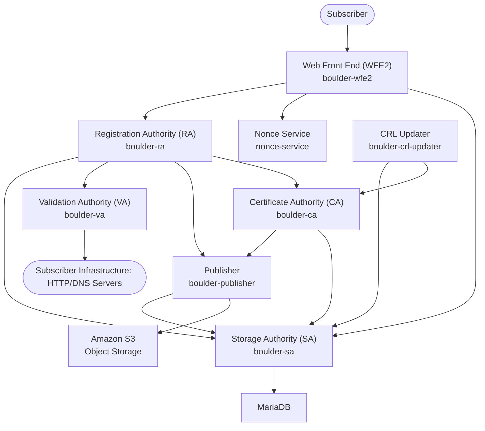

# Boulder Services

Boulder implements a microservices architecture for the ACME Certificate Authority, with distinct services handling different aspects of certificate issuance and management. This document outlines the core services, their responsibilities, and how they interact.

## Architecture Overview

Boulder follows a security-oriented design where components are separated by security context and network requirements:

## Core Services

### 1. **Web Front End (WFE2)** - `boulder-wfe2`

**Path:** `cmd/boulder-wfe2/`  
**Package:** `wfe2/`

The ACME protocol HTTP API endpoint that handles all client interactions.

**Responsibilities:**

- Implements ACME v2 RFC 8555 protocol endpoints
- JWS signature verification and authentication
- Rate limiting and abuse prevention
- CORS handling and HTTP request processing
- Account management endpoints
- Order and authorization management
- Challenge coordination

**Key Endpoints:**

- `/directory` - ACME directory with endpoint URLs
- `/acme/new-acct` - Account registration
- `/acme/new-order` - Certificate order creation
- `/acme/authz/{id}` - Authorization management
- `/acme/chall/{id}` - Challenge handling
- `/acme/finalize/{id}` - Order finalization
- `/acme/cert/{id}` - Certificate retrieval

**Dependencies:** RA, SA, Nonce Service

**AI Development Notes:**

- **Common tasks**: Adding new ACME endpoints, implementing protocol extensions, enhancing error handling
- **Key files**: `wfe2/wfe.go` (main handler logic), `wfe2/verify.go` (JWS verification)
- **Testing patterns**: Use `test/integration/` tests for full ACME flow validation
- **Rate limiting**: Configured via `wfe2-ratelimit-defaults.yml` and `wfe2-ratelimit-overrides.yml`

### 2. **Registration Authority (RA)** - `boulder-ra`

**Path:** `cmd/boulder-ra/`  
**Package:** `ra/`

Central orchestrator for certificate issuance workflow and policy enforcement.

**Responsibilities:**

- Account registration and management
- Certificate order processing and lifecycle management
- Authorization creation and validation coordination
- Policy enforcement (CAA, domain validation, rate limits)
- Certificate finalization and issuance coordination
- ACME object lifecycle management

**Key Operations:**

- `NewRegistration()` - Account creation
- `NewOrder()` - Certificate order creation with authorizations
- `PerformValidation()` - Challenge validation initiation
- `FinalizeOrder()` - Certificate issuance request processing

**Dependencies:** VA, CA, SA, Publisher

**AI Development Notes:**

- **Common tasks**: Implementing new certificate policies, adding validation rules, order workflow modifications
- **Key files**: `ra/ra.go` (main service logic), `ra/proto/ra.proto` (gRPC interface definitions)
- **Policy areas**: Rate limiting, CAA checking, domain validation policies, certificate profiles
- **Testing patterns**: Mock VA/CA/SA interactions for unit tests, use `ra/ra_test.go` patterns
- **Error handling**: Use `probs/probs.go` for ACME-compliant error responses

### 3. **Validation Authority (VA)** - `boulder-va`

**Path:** `cmd/boulder-va/`  
**Package:** `va/`

Performs domain control validation using ACME challenge types.

**Responsibilities:**

- HTTP-01 challenge validation (web server verification)
- DNS-01 challenge validation (DNS record verification)
- TLS-ALPN-01 challenge validation (TLS certificate verification)
- CAA record checking and policy enforcement
- Multi-perspective validation coordination
- Network reachability and security checks

**Challenge Types:**

- **HTTP-01:** Validates control via HTTP well-known URI
- **DNS-01:** Validates control via DNS TXT record
- **TLS-ALPN-01:** Validates control via TLS certificate

**Dependencies:** Remote VAs, DNS resolvers

**AI Development Notes:**

- **Common tasks**: Implementing new challenge types, enhancing validation security, adding CAA policy checks
- **Key files**: `va/va.go` (main validation logic), `va/http.go`, `va/dns.go`, `va/tlsalpn.go` (challenge-specific code)
- **Validation patterns**: Each challenge type has validate/cleanup phases, use existing patterns
- **Security considerations**: DNS hijacking protection, network isolation, timeout handling
- **Testing**: Use `va/va_test.go` patterns, mock DNS/HTTP responses with `bdns/` and `test/chall-test-srv/`
- **Multi-perspective**: Remote VA coordination via `cmd/remoteva/`

### 4. **Certificate Authority (CA)** - `boulder-ca`

**Path:** `cmd/boulder-ca/`  
**Package:** `ca/`

Core certificate issuance engine with cryptographic operations.

**Responsibilities:**

- X.509 certificate generation and signing
- Certificate serial number management
- Precertificate generation for Certificate Transparency
- Certificate profile enforcement
- Cryptographic policy enforcement
- Certificate lifecycle management

**Security Features:**

- HSM integration via PKCS#11
- Certificate Transparency integration
- Multiple issuer certificate support
- Certificate profile validation

**Dependencies:** SA, CT logs (via Publisher)

**AI Development Notes:**

- **Common tasks**: Adding certificate extensions, implementing new certificate profiles, enhancing issuance policies
- **Key files**: `ca/ca.go` (main issuance logic), `issuance/cert.go` (certificate generation), `ca/proto/ca.proto` (gRPC interface)
- **Certificate profiles**: Defined in `issuance/` package, use existing profile patterns
- **HSM operations**: All private key operations go through PKCS#11 interface
- **Testing**: Use test certificates in `test/certs/`, mock HSM with `test/` helpers
- **Security note**: The CA service is designed to be heavily network-restricted in production environments, with all private key operations handled by an HSM. It should have minimal inbound and outbound network access.

### 5. **Storage Authority (SA)** - `boulder-sa`

**Path:** `cmd/boulder-sa/`  
**Package:** `sa/`

Database abstraction layer and persistent storage management.

**Responsibilities:**

- Database operations and transaction management
- ACME object persistence (accounts, orders, authorizations, certificates)
- Certificate storage and retrieval
- Rate limiting data management
- Database schema management and migrations
- Audit logging and compliance

**Data Models:**

- Registrations (ACME accounts)
- Orders and authorizations
- Challenges and validations
- Certificates and issuance records
- Rate limit counters

**Dependencies:** MariaDB/MySQL database

**AI Development Notes:**

- **Common tasks**: Adding new database tables, implementing data queries, creating migrations
- **Key files**: `sa/sa.go` (main service), `sa/model.go` (data models), `sa/proto/sa.proto` (gRPC interface)
- **Database patterns**: Use GORM for ORM, follow existing model patterns in `sa/model.go`
- **Migrations**: Add to `sa/db/boulder_sa/` with timestamp prefix, test with `sa/migrations.sh`
- **Testing**: Use `test/create_db.sh` for test database setup, `satest/satest.go` for helpers
- **Performance**: Consider read replicas, use `sa_ro` user for read-only operations

### 6. **Publisher** - `boulder-publisher`

**Path:** `cmd/boulder-publisher/`  
**Package:** `publisher/`

Handles Certificate Transparency log submission and external integrations.

**Responsibilities:**

- Certificate Transparency log submission
- SCT (Signed Certificate Timestamp) collection
- External compliance reporting
- Certificate publication workflows
- Publishing artifacts (e.g., CRLs) to external object storage (e.g., Amazon S3)

**Dependencies:** CT logs, SA, External Object Storage (e.g., Amazon S3)

**AI Development Notes:**

- **Common tasks**: Adding new CT log endpoints, implementing submission policies, enhancing retry logic, integrating with new external storage.
- **Key files**: `publisher/publisher.go` (main submission logic), `ctpolicy/ctpolicy.go` (CT policy enforcement)
- **CT integration**: Follows RFC 6962, submits precertificates and collects SCTs
- **Testing**: Use `test/ct-test-srv/` for CT log mocking, `ctpolicy/ctpolicy_test.go` patterns

### 7. **Nonce Service** - `nonce-service`

**Path:** `cmd/nonce-service/`  
**Package:** `nonce/`

Provides cryptographic nonces for ACME request replay protection. It generates nonces by encrypting a monotonically increasing counter. Redemption involves decrypting and validating the counter against a window of acceptable values and a list of already used nonces.

**Responsibilities:**

- Nonce generation: Creates unique nonces, typically by encrypting an internal counter.
- Nonce validation: Checks if a provided nonce is legitimate, unused, and within its validity period.
- Anti-replay attack protection: Ensures each nonce is used only once.
- HMAC-based nonce prefixing: Derives a nonce prefix using HMAC-SHA256 from the service's listening address and a configured secret key (`NonceHMACKey`). This helps ensure nonces are instance-specific or group-specific if keys are shared.
- Manages nonce lifecycle using internal counters (`latest`, `earliest`) and a cross-off list for redeemed nonces.

**gRPC Interface (`nonce.proto`):**

- `Nonce(google.protobuf.Empty) returns (NonceMessage)`: Retrieves a new nonce.
- `Redeem(NonceMessage) returns (ValidMessage)`: Validates a submitted nonce.

**Dependencies:**

- A configured `NonceHMACKey` (secret key file). This key is used with the service's gRPC address to derive a unique prefix for nonces generated by a specific instance, aiding in nonce management in multi-instance deployments.
- The Nonce Service, as implemented in `nonce/nonce.go` and configured in the typical development/test setups (e.g., `test/config/nonce-a.json`), uses an in-memory store for tracking recently issued and redeemed nonces.

**AI Development Notes:**

- **Common tasks**: Enhancing nonce validation algorithms, implementing distributed nonce tracking, performance optimization
- **Key files**: `nonce/nonce.go` (main nonce logic), `nonce/proto/nonce.proto` (gRPC interface)
- **Security considerations**: Nonce uniqueness, replay protection, cryptographic strength
- **Testing**: Use `nonce/nonce_test.go` patterns, test nonce generation and validation flows

## Supporting Services

### 8. **Remote Validation Authority (Remote VA)** - `remoteva`

**Path:** `cmd/remoteva/`

Provides multi-perspective validation from different network vantage points.

**Responsibilities:**

- Remote validation execution
- Geographic diversity in validation
- Network path diversity
- Validation result aggregation

### 9. **Simplified Front End (SFE)** - `sfe`

**Path:** `cmd/sfe/`  
**Package:** `sfe/`

Self-service portal for account management and certificate services.

**Responsibilities:**

- Account unpausing interface
- Subscriber self-service operations
- Web-based certificate management
- User-facing documentation and help

### 10. **Observer** - `boulder-observer`

**Path:** `cmd/boulder-observer/`  
**Package:** `observer/`

Monitoring and metrics collection service.

**Responsibilities:**

- Certificate transparency log monitoring
- Certificate issuance monitoring
- Compliance and audit reporting
- Anomaly detection

### 11. **CRL Updater** - `boulder-crl-updater`

**Path:** `cmd/boulder-crl-updater/` (presumed, verify actual path)  
**Packages:** `crl/updater/`, `crl/checker/`, `crl/storer/`

Manages the lifecycle of Certificate Revocation Lists (CRLs). This service or tool is responsible for generating new CRLs, ensuring their correctness, having them signed by the CA, and making them available for distribution.

**Responsibilities:**

- **CRL Generation**: Compiles lists of revoked certificates from data in the Storage Authority (SA).
- **CRL Signing**: Coordinates with the Certificate Authority (CA) to sign newly generated CRLs.
- **CRL Storage**: Stores signed CRLs, typically using the Storage Authority (SA), so they can be published.
- **CRL Checking**: Performs validation checks on CRLs, utilizing functionality from the `crl/checker/` package.
- **Scheduling**: Often runs as a periodic job to ensure CRLs are kept up-to-date.

**Key Operations & Packages:**

- Uses the `crl/updater/` package for overall orchestration.
- Leverages `crl/checker/` for validating CRL contents and structure.
- Interacts with `crl/storer/` (or directly with SA) for persisting and retrieving CRL data.
- Common CRL definitions and types are in `crl/crl.go`.

**Dependencies:** CA, SA

**AI Development Notes:**

- **Common tasks**: Modifying CRL generation logic, updating CRL profiles or extensions, enhancing CRL validation, changing storage mechanisms.
- **Key files**: `crl/updater/updater.go` (likely main logic), `crl/checker/checker.go`, `crl/storer/storer.go`.
- **Interaction points**: Understand how it fetches revocation data (from SA), requests signing (from CA), and stores CRLs (to SA).

## Service Communication

All inter-service communication uses **gRPC** with protocol buffer definitions located in:

- `ca/proto/` - Certificate Authority interfaces
- `ra/proto/` - Registration Authority interfaces
- `sa/proto/` - Storage Authority interfaces
- `va/proto/` - Validation Authority interfaces

### Security Context Separation

**Internet-facing services** (higher risk):

- WFE2 - Public ACME API
- VA - Domain validation
- Publisher - External log submission

**Internal services** (lower risk):

- RA - Internal coordination
- CA - Certificate signing (air-gapped)
- SA - Database operations

### Service Discovery

Boulder uses **Consul** for service discovery and health checking, with configuration in `test/consul/config.hcl`.
